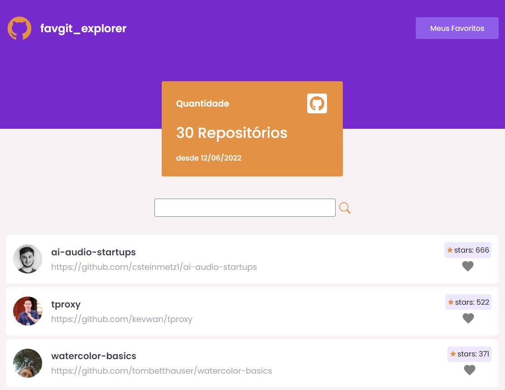

# favgit
<h1 align="center" >
    
</h1>

<h4 align="center">
FAVGIT
</h4>

  <a href="#-tecnologias">Tecnologias</a>&nbsp;&nbsp;&nbsp;|&nbsp;&nbsp;&nbsp;
  <a href="#-projeto">Projeto</a>&nbsp;&nbsp;&nbsp;|&nbsp;&nbsp;&nbsp;
  <a href="#-layout">Configuração</a>

 

  

## : Tecnologias

Esse projeto foi desenvolvido com as seguintes tecnologias:

- [React](https://reactjs.org)
- [TypeScript](https://www.typescriptlang.org/)
- [Vite](https://vitejs.dev/guide/#scaffolding-your-first-vite-project)
- [Styled-Components](https://styled-components.com/)
- [React-Modal](https://reactcommunity.org/react-modal/)
- [React-Icons](https://react-icons.github.io/react-icons/)

## 💻 Projeto

O favgit é um projeto que busca informações da api do github, mostra um dashboard em tela, e possui as seguintes funcionalidades:
- Tela de login - usuário = favgit@gmail.com | senha = favgit
- lista dos repositórios criados nos últimos 7 dias com o maior número de estrelas do github
- lista possui informações como: imagem do autor, nome, link e quantidade de estrelas do repositório
- Card com informações de quantidade de repositórios
- Filtro de busca da lista de repositórios
- Possível savar repositório como favorito
- funcionalidade de visualizar em um modal os repositórios salvos - botão Meus Favoritos- obs: salvo no localStorage
- Botão de sair do sistema

## ⚙ Configuração

1- Antes de começar, você vai precisar instalar na sua máquina as seguintes ferramentas: Git, Node. Além disso, é bom ter um editor para trabalhar com código, como o <a href="https://code.visualstudio.com/download">VSCode</a>.

Para instalar as dependências no front-end:
> npm install
Para iniciar a aplicação no front-end:
> npm run dev
